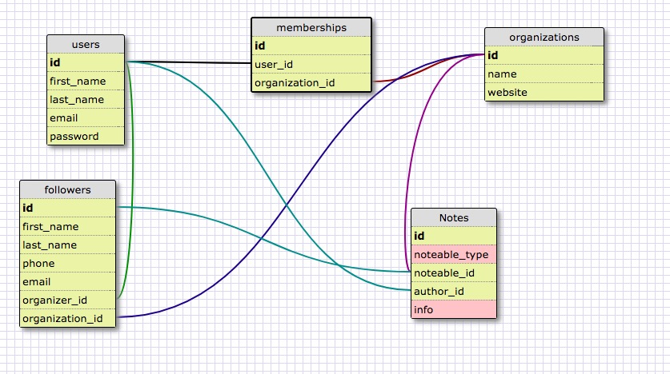

# README

This is a Rails application to help community organizers follow up on organizees, actions, and other information. 

As a user you are able to..
	+ Create an account
	+ Add followers
	+ Create notes about followers
	+ Add tags to followers and notes 

There is partial RSpec unit testing as well as an attempt to use TravisCI for integretation testing (see, though, [here](https://github.com/karrkode/follow_up/issues/15)) to check out the issue I've raised on why it's not working. :( That being said, this app uses the Goolge Maps API for both data input as well as visualization of followers. 

For ideas on where it's going forward, check out my [Trello](https://trello.com/b/2AeBVEEs/follow-up). I'm most excited to add a way to create organizer terf sheets.  If you have any questions, reach out to me at aacarr5@gmail.com! 

