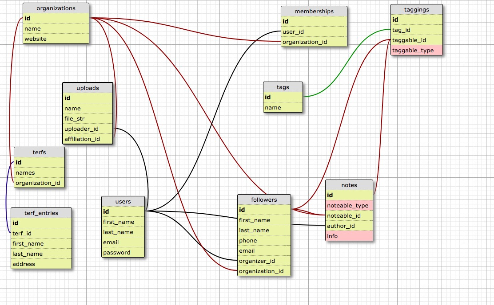

# README

This is a Rails application to help community organizers follow up on organizees, actions, and other information.

As a user you are able to..

* Create an account
* Add followers
* Create notes about followers
* Add tags to followers and notes
* Upload files to AWS S3

There is partial RSpec unit testing as well as TravisCI testing. The application also uses AWS S3 to upload documentation as well as the Google Maps API to simplify data input as well as visualize user information. The main feature I'm building is a way for users to upload CSV/Excel files of addresses and have the app return generated terf sheets.

Please check out any raised issues to also learn moree about the application.

For more ideas on where it's going forward, check out my [Trello](https://trello.com/b/2AeBVEEs/follow-up). I'm most excited to add a way to create organizer turf sheets. If you have any questions, reach out to me at aacarr5@gmail.com!

<!-- brew services restart postgresql (give this command when app won't start?) -->
